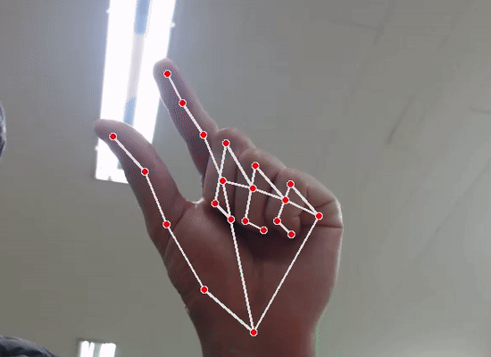

# Project Summary

**Customer:** [insert]

**Project name:** [insert]

**Project goal:** Define the high level goal of the project.

## Objectives:

- Break out the project goal into more specific objectives
- [insert]
- [insert]

## Constraints:

- Define contraints like budget, time, abilities, regulations, etc.
- [insert]
- [insert]
- [insert]
- [insert]
- [insert]

## Risks:

- Equipment delays [**SIGNIFICANT RISK**]
- Over budget [MODEST RISK]
- Use ‘Significant’ or ‘Modest’ as risk levels and bold Significant risks.

## Assumptions:

- List of assumtions outside the scope of the project.
- Example: Contractor will provide tools and materials
- [insert]

## Project Scope

## In Scope:

- Define actions within the scope of the project.
- [insert]
- [insert]

## Out of Scope:

- Define actions outside the scope of the project.
- [insert]
- [insert]

## Deliverables:

- Define specific completed deliverables by the end of the project.
- [insert]
- [insert]

## Tasks and Estimated Costs

| Task | Estimated Costs | Notes |
|------|-----------------|-------|
|ex. Furniture|$1,000| |
|Decorations|$250|*wall art*|
|**TOTAL**|**$1,250**|*estimated*|

## Closing Checklist

- [ ]  All Deliverables Checked and Tested for Quality Requirements
- [ ]  Deliver Documentation and/or Training (*If Required*)
- [ ]  Get Customer/Management/Stakeholder Sign-Off
- [ ]  Reassign Personnel, Dispose of Surplus Equipment/Materials, and Release Facilities
- [ ]  Document Project (*Problems, Lessons Learned, Etc.*)
- [ ]  Report Final Project Status and Outcome to Customer/Management/Stakeholders
- [ ]  Declare Project Completed

# 모션 트랙킹 마우스&키보드

## 팀 구성 

|이름|임무(정)|임무(부)|
|---|---|---|
|김승환|키보드|마우스|
|기묭철|마우스|키보드|
|임선웅|올어라운드|스페셜리스트|

## 모션 사용법

### 마우스 클릭 (좌)

### 마우스 더블클릭 (좌)

### 마우스 클릭 (우)

### 마우스 드래그

### 마우스 클릭&드래그 (좌)

### 키보드로 변경

