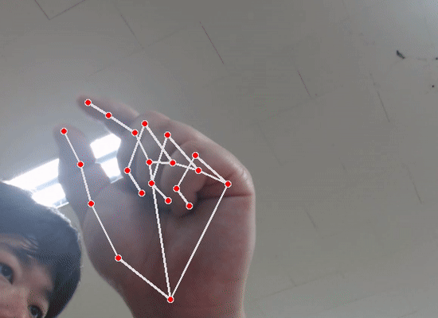

# 프로젝트 요약

**Project name:** 모션트랙킹 마우스 & 음성인식 키보드

**Project goal:** 이 프로젝트의 목표는 사용자의 편의성과 접근성을 향상시키는 것입니다. 모션과 음성을 활용함으로써 기존의 마우스와 키보드 조작 방식에 비해 더 자연스럽고 효율적인 컴퓨터 조작 경험을 제공하는 것이 목적입니다.

## 팀구성

|이름|임무(정)|임무(부)|
|---|---|---|
|김승환|키보드|마우스|
|기묭철|마우스|키보드|
|임선웅|올어라운드|스페셜리스트|

## Objectives:

사용자 경험 향상: 프로젝트의 주요 목표 중 하나는 사용자의 컴퓨터 조작을 보다 자연스럽고 편리하게 만드는 것입니다. 
액세스 가능성 향상: 음성인식 기술을 통해 장애인이나 신체적 제약이 있는 사용자들도 키보드와 마우스를 사용하지 않고도 컴퓨터를 조작할 수 있는 가능성을 제시합니. 
효율성 향상:  키보드를 타이핑하는 것보다 음성 명령을 사용하여 빠르고 정확하게 텍스트를 입력할 수 있으며, 마우스를 움직이는 대신 손의 제스처를 사용하여 컴퓨터를 조작할 수 있습니다.
기술 혁신: 이 프로젝트는 새로운 인터페이스 기술을 개발하고 적용함으로써 기존의 키보드와 마우스 조작 방식을 넘어선다는 기술적 도전을 제공합니다.

## Constraints:

- 프로젝트를 완료하는 데 할당된 시간이 제한되어 있습니다. 
- [insert]
- [insert]
- [insert]
- [insert]
- [insert]

## Assumptions:

- 음성인식 기술을 사용하는 부분에서 인터넷 속도에 제한을 받는 경우가 있습니다.

# 프로젝트 범위 및 계획

## In Scope:

- Mediapipe를 통한 모션 마킹 구현
- 모션을 통한 마우스 제어 구현
- 음성 인식을 통한 Speech to text 구현

## Out of Scope:

- 복잡한 모션을 통한 제어 구현
- 라즈베리파이에 구현
- C++구현

## Gantt Chart

## Kanban

|BACKLOG  |TO-DO    |IN-PROGRESS        |COMPLETED       |
|---------|---------|-------------------|----------------|
|Speech to text 코딩  |         |                   |completed       |
|영상 마킹         |         |in-progress        |                |
|모션 인식         |to-do    |                   |                |
|코드 병합         |to-do    |                   |                |
|실행 파일 생성         |to-do    |                   |                |

# 기술 요약

## 모션 사용법

### 마우스 클릭 (좌)

### 마우스 더블클릭 (좌)

### 마우스 클릭 (우)

### 마우스 드래그

### 마우스 클릭&드래그 (좌)

### 키보드로 변경

